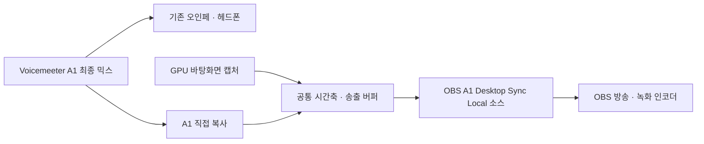

# OBS 원컴 방송 · A1 로컬 소스

**기존 화면 캡처와 Voicemeeter A1 최종 믹스, 공통 버퍼를 OBS 소스 하나로 받습니다.** NDI 송신·수신이나 중간 영상 인코딩 없이 OBS 프로세스 안에서 동작합니다. 방송·녹화 인코딩은 OBS가 담당합니다.

## 현재 구성으로 시작

1. Voicemeeter와 사용하는 DAW를 켜서 A1로 소리가 나오는지 확인합니다.
2. [start-obs.bat](start-obs.bat)를 더블클릭합니다.
3. OBS 프로필과 장면 모음은 **A1 Local**, 장면은 **A1 Local Broadcast**입니다.
4. **A1 Desktop + Audio** 소스 하나에 화면과 A1 소리가 함께 들어옵니다.
5. OBS의 녹화 시작 또는 방송 시작을 사용합니다. 방송 서비스 연결과 송출 인코더·비트레이트는 플랫폼에 맞춰 별도로 설정합니다.

`start-obs.bat`는 별도 NDI 송신기가 실행 중이면 먼저 정상 종료를 요청합니다. OBS가 이미 열려 있으면 중복 실행하지 않으므로 직접 A1 Local을 선택하세요. OBS를 종료하면 로컬 캡처도 끝납니다. [stop.bat](stop.bat)는 별도 NDI 송신기용이며 OBS를 닫지 않습니다.

현재 기본 설정 파일의 해상도·FPS·500ms 버퍼·보정값을 읽습니다. **OBS 소스 속성의 구성 파일 경로는 `sender.ini`**입니다. 파일 수정 후에는 소스 속성을 열고 확인을 눌러 캡처를 다시 시작합니다. OBS의 캔버스와 출력 FPS는 OBS 설정에서도 맞춰 주세요.

## 신호 경로



A1 마스터 처리 후 채널을 복사합니다. B2를 따로 구성할 필요가 없습니다. 같은 믹스를 중복 캡처하지 않도록 이 장면의 전역 데스크톱 오디오·마이크 입력은 비워 두었고, 로컬 소스의 모니터링도 꺼져 있습니다.

NDI 송신기와 OBS 소스는 [AlignedCapture](src/aligned_capture.hpp), 화면 캡처, 오디오 콜백, 샘플 시계 코드를 공유합니다. OBS 어댑터는 이미 기다린 버퍼의 영상·오디오 시각을 **같은 상수만큼** OBS 시간축으로 옮깁니다. 영상과 소리의 상대적인 시간차는 바꾸지 않으며 두 번째 500ms 대기를 추가하지 않습니다.

## 새 PC에서 설치

이 버전은 **OBS Studio 32.0.1 Windows x64**에 맞춰 빌드·검증했습니다. 다른 OBS 버전은 SDK 핀과 호환성을 확인해야 합니다.

1. OBS, Voicemeeter, VS 2022 C++ Build Tools와 Windows SDK, CMake 3.24 이상을 설치합니다.
2. OBS를 한 번 실행해 초기 설정을 만든 뒤 종료합니다.
3. 프로젝트 폴더에서 아래 명령을 실행합니다.

```powershell
powershell -NoProfile -ExecutionPolicy Bypass -File .\Build-OBSPlugin.ps1
powershell -NoProfile -ExecutionPolicy Bypass -File .\Install-OBSPlugin.ps1
```

빌드 스크립트는 OBS 32.0.1의 공식 소스 아카이브를 내려받아 SHA-256을 확인하고 공개 헤더를 사용합니다. OBS 본체나 런타임 DLL을 복사해 배포하지 않습니다. 설치 위치는 `%ProgramData%\obs-studio\plugins\a1-local-source\bin\64bit`이며 권한이 필요할 수 있습니다.

OBS의 소스 추가에서 **A1 Desktop Sync (Local)**을 고르고, 구성 파일에 이 프로젝트의 `sender.ini`를 지정해도 됩니다. Python은 플러그인 실행에 필요 없습니다.

이 PC처럼 별도 장면·프로필을 자동 준비하려면 OBS가 종료된 상태에서 실행합니다.

```powershell
python tools\setup_obs_local.py
```

이 스크립트는 기존 장면을 보존하며 별도 A1 Local을 만듭니다. 기존 사용자 설정을 `logs/obs-before-local-…`에 백업하고, OBS NDI 메인·미리보기 출력을 끕니다. 같은 이름의 장면·프로필이 이미 있으면 덮어쓰지 않습니다. 자동 녹화 설정은 NVENC를 사용하는 현재 PC용이므로 다른 GPU에서는 OBS 녹화 인코더를 변경하세요. 방송 계정은 구성하지 않습니다.

## 확인과 제한

- `logs/obs-status.json`: 로컬 캡처 fps·큐·누락·오디오 피크.
- `logs/obs-control-status.json`: 설치 스크립트로 추가한 검사 도구의 OBS 녹화·방송 상태.
- 검사 녹화는 `logs/obs-recordings/`에 저장합니다. 이 폴더는 Git에서 제외됩니다.
- 같은 A1 캡처를 NDI 송신기와 동시에 열 수 없습니다. 여러 장면에 넣을 때는 **기존 소스 추가**를 사용하세요.
- 구성 파일을 처음 선택하지 않은 새 소스는 입력 선택 전까지 대기합니다.
- 소스 속성의 진단 플래시·톤은 실제 화면/A1 대신 시험 신호를 넣습니다. 평소에는 꺼 둡니다.
- OBS에 설치된 DistroAV가 자체적으로 NDI 런타임을 로드할 수는 있지만, 이 로컬 소스는 NDI를 사용하지 않습니다. NDI 출력 설정은 별개입니다.
- 기존 `audio_offset_ms=0`, `calibration_verified=false`의 의미도 유지됩니다. 합성 시험 통과가 실제 모니터·오인페의 물리적 출력 시각까지 검증했다는 뜻은 아닙니다.

OBS 소스 API는 비동기 영상과 오디오의 공통 타임스탬프를 지원합니다. [OBS 공식 소스 API](https://docs.obsproject.com/reference-sources)

플러그인은 GPL 라이선스의 libobs 공개 API에 연결됩니다. OBS 헤더와 사용 조건의 원문은 공식 소스의 COPYING에 있습니다. 공개 배포 시 OBS 및 Voicemeeter 구성 요소의 라이선스 조건을 함께 검토해야 합니다.

## Stream Deck에서 제어

최신 Stream Deck의 **로컬 캡처** 패널에서 설정 저장·적용과 소스 시작·중지를 지원합니다. 두 tools/obs-local-control.lua 및 tools/deck-local-control.lua 파일을 함께 갱신하고 OBS 스크립트를 다시 로드하세요. 첫 저장부터 local-capture.ini를 별도로 사용하며 sender.ini는 NDI용으로 보존합니다. 캡처 중지는 OBS 자체를 닫지 않습니다. 저장 후 적용은 캡처를 잠시 재시작합니다.
