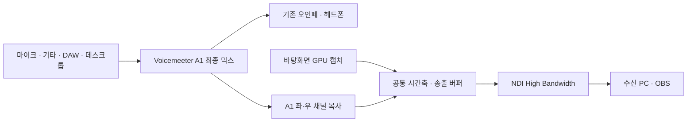

# A1 NDI Sender

**원컴 OBS 방송:** [OBS 로컬 소스 안내](OBS-LOCAL.md)를 참고하세요. [start-obs.bat](start-obs.bat)는 기존 A1·화면 버퍼를 OBS 안에서 직접 사용합니다. NDI 모드는 아래 [start.bat](start.bat)로 실행합니다.

**Voicemeeter A1에서 듣는 최종 믹스와 바탕화면을 한 NDI 소스로 보내는 Windows 전용 송신기.**

송신 PC에서 OBS 없이 동작합니다. 마이크·기타·DAW·브라우저 소리를 A1에서 한 번 섞은 뒤 그대로 가져오고, 화면과 공통 시간축으로 정렬해 전송합니다. 방송의 전체 지연을 허용하면서 영상과 소리의 상대적인 시간 관계를 유지하는 용도입니다.

> **상태: 초기 구현, 로컬 송수신 검증 완료.** 실제 A1 캡처와 1080p60 전송을 확인했습니다. 모든 장치에서의 자동 싱크 보정이나 다른 PC OBS까지 완전한 동기화를 보장하는 단계는 아닙니다. 측정 결과와 검증 범위는 [VALIDATION.md](VALIDATION.md)를 참고하세요.

## 주요 기능

- **A1 직접 캡처:** Voicemeeter Main Callback에서 마스터 처리 후 A1의 좌·우 채널을 복사합니다.
- **1080p30 기본 출력, 60 FPS 선택 가능:** GPU에서 화면 크기와 Rec.709 UYVY 색상을 변환합니다.
- **시간 정렬:** 화면의 QPC 시각과 복원한 오디오 샘플 시계, 명시적인 NDI 타임코드를 사용합니다.
- **공통 송출 버퍼:** 기본 500ms. 송출용 복사본에 적용하며, 기존 헤드폰 경로에 이 대기 시간을 추가하지 않습니다.
- **실행 관리:** 더블클릭 시작, 트레이 종료 메뉴, 중복 실행 방지, 상태 로그.
- **진단 도구:** 오프라인 캡처 검사, 합성 AV 시험, NDI 수신 검사, 기준 패턴의 시간차 분석.

## 준비 사항

| 구분 | 필요한 환경 |
|---|---|
| 운영체제 | Windows 10/11 x64 |
| 그래픽 | Direct3D 11 / Shader Model 5 지원 GPU, SDR 가로 모니터 |
| 오디오 | 실행 중인 [Voicemeeter](https://vb-audio.com/Voicemeeter/), 정상 출력 중인 A1 |
| NDI | 설치된 NDI 6 런타임. 기본 설정은 [NDI Tools](https://ndi.video/tools/) 설치 경로 사용 |
| 수신 | NDI 수신 프로그램. OBS에서는 [DistroAV](https://github.com/DistroAV/DistroAV) 등의 NDI 플러그인 필요 |
| 네트워크 | 두 PC를 연결하는 기가비트 유선 LAN 권장 |
| 처음 빌드할 때 | CMake 3.24 이상, Visual Studio 2022 C++ Build Tools, Windows SDK |

FL Studio는 필수가 아닙니다. 사용하는 DAW, 마이크·기타·데스크톱 소리가 **A1로 들리는 상태**를 먼저 만들어 주세요. 샘플레이트는 Voicemeeter 엔진을 따르며, 검증 환경은 Banana·Focusrite USB ASIO·48kHz·256샘플입니다.

Standard·Banana·Potato의 A1 채널 배치를 구현했으며, 실제 장치 검증은 Banana에서 진행했습니다.

## 빠른 시작

### 송신 PC

1. 저장소를 클론하거나 ZIP으로 받아 **압축을 풉니다.**
2. Voicemeeter를 실행하고 A1에서 원하는 소리가 들리는지 확인합니다.
3. **[start.bat](start.bat)를 더블클릭합니다.**
4. 송신기가 백그라운드에서 실행됩니다. 트레이 아이콘은 Windows의 숨겨진 아이콘 영역에 있을 수 있습니다.

실행 파일이 없다면 `start.bat`가 처음 한 번 빌드와 테스트를 수행합니다. 위의 빌드 도구가 설치되어 있어야 하며, 필요한 소프트웨어를 자동 설치하지는 않습니다. 이후에는 빌드된 실행 파일을 바로 시작합니다. 실행 중에 다시 더블클릭해도 두 번째 송신기를 만들지 않습니다.

기존 `Start-Sender.cmd`도 같은 시작 동작으로 연결됩니다. 시작에 실패하면 오류 메시지가 창에 남으며, 자세한 내용은 `logs/run-error.log`를 확인할 수 있습니다.

### 수신 PC의 OBS

1. NDI 플러그인을 설치한 OBS에서 **NDI Source**를 추가합니다.
2. **`송신PC이름 (A1 Desktop Sync)`**를 선택합니다. 이름은 `sender.ini`의 `name`으로 변경할 수 있습니다.
3. 화면과 오디오 미터를 확인합니다. NDI에 이미 A1 소리가 포함되므로 같은 소리를 별도 소스로 다시 받아 중복시키지 않도록 구성합니다.
4. 플러그인이 지원하면 송신 타임코드를 사용하는 동기화 모드로 설정하고, 이전 송신기의 수동 지연값이 중복 적용되지 않았는지 확인합니다.

### 종료

**[stop.bat](stop.bat)를 더블클릭**하거나 트레이 아이콘의 **Stop sender**를 선택합니다.

이 프로그램은 다른 송신 프로그램을 자동 종료하거나 Windows 로그인 자동 시작을 등록하지 않습니다.

## 오디오와 영상 경로



A1에 새 장비나 소스를 추가하면 송출 믹스에도 반영됩니다. **A1의 마스터 볼륨·음소거도 송출에 반영**됩니다. 헤드폰의 청취 음량만 조절하려면 오인페의 헤드폰 노브를 사용하세요.

이미 A1에 섞인 마이크·기타·데스크톱 소리의 상대적인 타이밍을 유지합니다. 각 입력이 A1에 도착하기 전에 생긴 시간차를 개별적으로 고치는 기능은 아닙니다.

## 설정

송신기를 종료한 뒤 루트의 [sender.ini](sender.ini)를 수정하고 다시 실행합니다.

| 설정 | 기본값 | 설명 |
|---|---|---|
| `name` | `A1 Desktop Sync` | NDI 소스 이름. 수신 화면에서는 PC 이름이 앞에 붙음 |
| `width` / `height` | `1920` / `1080` | 송출 크기. 가로 크기는 짝수 |
| `fps` | `60` | 초당 프레임 수, 15~60 |
| `monitor` | `0` | 연결된 모니터의 0부터 시작하는 열거 번호 |
| `buffer_ms` | `500` | 공통 송출 대기 시간, 200~2000ms |
| `audio_offset_ms` | `0` | 영상에 대한 소리 보정. 양수는 늦춤, 음수는 앞당김 |
| `calibration_verified` | `false` | 보정값 검증 여부를 기록하는 표시. 자체 보정 기능을 켜는 옵션이 아님 |
| `ndi_dll` | NDI Tools 기본 설치 경로 | `Processing.NDI.Lib.x64.dll` 경로 |
| `voicemeeter_dll` | Voicemeeter 기본 설치 경로 | `VoicemeeterRemote64.dll` 경로 |

`audio_offset_ms`의 절댓값은 `buffer_ms - 100` 이하여야 합니다. 예를 들어 500ms 버퍼에서는 -400~+400ms를 허용합니다. 양쪽에 공통으로 추가하는 버퍼 크기만 바꿔서는 상대적인 AV 시간차가 보정되지 않습니다.

Voicemeeter나 NDI를 다른 위치에 설치했다면 DLL 경로를 실제 설치 위치로 바꿔 주세요.

## 싱크 방식과 검증 범위

1. **화면:** Desktop Duplication의 `LastPresentTime`을 시스템 QPC 시간축으로 변환합니다.
2. **오디오:** A1 콜백의 샘플 수와 QPC 관측을 사용합니다. 콜백 도착 흔들림을 완화하고 지속적인 시계 차이를 천천히 추적합니다.
3. **전송:** 공통 버퍼를 거쳐 해당 시점의 화면과 오디오를 내보냅니다. 타임코드뿐 아니라 실제 송신 순서와 속도도 관리합니다.
4. **과부하:** 대기열을 무한히 쌓지 않고 오래된 작업을 폐기하며, 시간축과 누락 기록을 유지합니다.

Voicemeeter Main Callback은 최종 오인페의 **하드웨어 재생 시각**을 제공하지 않습니다. 기본값 `audio_offset_ms=0`은 소프트웨어 시계 정렬입니다. 모든 장치의 실제 출력 지연을 자동으로 알아내거나, 유튜브의 입 모양을 분석해 싱크를 자동 교정하는 기능은 없습니다.

필요하면 알려진 영상·소리 패턴으로 시간차를 측정하고 `audio_offset_ms`를 보정합니다. 수신 OBS의 별도 지연이나 네트워크 손실까지 송신기에서 강제할 수는 없으므로, 최종 판단은 수신 PC의 녹화로 확인합니다.

## 직접 빌드

Visual Studio Installer에서 **C++를 사용한 데스크톱 개발** 구성 요소와 Windows SDK를 설치하고, CMake가 PATH에 포함되어 있는지 확인합니다. 프로젝트 폴더에서 실행합니다.

```powershell
powershell.exe -NoProfile -ExecutionPolicy Bypass -File .\build.ps1
```

또는 CMake를 직접 사용합니다.

```powershell
cmake -S . -B build -G "Visual Studio 17 2022" -A x64
cmake --build build --config Release --parallel
ctest --test-dir build -C Release --output-on-failure
```

빌드 결과는 `build\Release\a1-ndi-sender.exe`입니다. 소스를 수정한 뒤에는 송신기를 종료하고 다시 빌드하세요. `start.bat`는 실행 파일이 있을 때 소스 변경 여부를 검사해 재빌드하지 않습니다.

**Python은 송신기 실행이나 C++ 빌드에 필요 없습니다.** 아래 진단 도구에만 사용합니다.

## 상태 확인과 문제 해결

`logs/status.json`에 실행·캡처 상태, fps, 오디오 피크, NDI 연결 수, 대기열, 누락, CPU·메모리 사용량을 기록합니다. `healthy=true`는 캡처 동작 상태이며 최종 AV 싱크 검증을 뜻하지 않습니다.

| 현상 | 확인할 내용 |
|---|---|
| 첫 실행에서 빌드 실패 | CMake, VS 2022 C++ Build Tools, Windows SDK 설치 여부 |
| `Cannot load runtime DLL` | `sender.ini`의 DLL 경로와 x64 런타임 |
| `Start Voicemeeter before starting the sender` | Voicemeeter를 먼저 실행하고 A1 출력 장치 설정 |
| `VM Main callback unavailable` | 다른 프로그램이 Main Callback을 사용 중인지 확인. 오류의 owner 이름 참고 |
| 화면은 있지만 소리가 없음 | A1 미터·마스터 음소거·입력 라우팅, `audio_peak` 값 |
| 수신 PC에서 소스가 안 보임 | 같은 LAN 연결, 프로그램의 방화벽 허용 상태, NDI 검색 설정 |
| 영상이 끊기거나 큐 누락이 증가 | CPU/GPU 부하, 두 PC의 기가비트 링크, 중복 송신 |
| 트레이 아이콘이 안 보임 | Windows 숨겨진 아이콘 영역. `stop.bat`로도 종료 가능 |
| 화면과 소리 사이에 일정한 차이가 있음 | 기존 수신 오프셋 확인, 알려진 시험 패턴으로 측정 |

기본 송출은 **NDI High Bandwidth**입니다. 움직임이 많은 1080p60을 두 PC 사이에서 사용하려면 기가비트 LAN을 준비하세요. 현재 구현에는 NVENC 기반 HX 송출이나 자동 저대역폭 전환이 없습니다.

## 진단 도구

진단 도구를 사용할 때만 Python 환경에 의존성을 설치합니다.

```powershell
python -m pip install -r tools\requirements.txt
```

### 화면·A1 캡처만 확인

일반 송신기를 먼저 종료합니다. 이 모드는 NDI DLL을 로드하거나 네트워크로 전송하지 않습니다.

```powershell
.\build\Release\a1-ndi-sender.exe --probe-only --duration 10 --log-dir logs\capture
```

### 합성 신호로 NDI 시간 처리 검사

일반 송신기를 먼저 종료합니다. 실제 화면·A1 대신 코드에서 생성한 흰 화면과 997Hz 톤을 전송합니다.

```powershell
.\build\Release\a1-ndi-sender.exe --self-test --duration 30
```

실행 중 별도 터미널에서 수신합니다.

```powershell
python tools\receive_probe.py --name "A1 Desktop Sync Test" --seconds 15 --expect-pulses --out logs\synthetic
```

### 실제 송출 관측

일반 송신기를 켠 상태에서 실행합니다.

```powershell
python tools\receive_probe.py --name "A1 Desktop Sync" --seconds 20 --out logs\live
```

JSON 측정값, 축소 영상·PCM·타임코드를 담은 NPZ, 첫 프레임 PNG를 저장합니다. 송신기를 `--trace`로 실행하면 프레임별 CSV도 기록할 수 있습니다.

### 기준 패턴으로 보정값 계산

**2초 간격으로 동시에 발생하는 흰 플래시·997Hz 톤**을 가진 기준 영상용입니다. 기준 영상을 화면에 보이게 재생하면서 위 도구로 실제 송출을 수신한 다음 분석합니다. 일반 음악·게임 녹화에는 적용하지 마세요.

```powershell
python tools\analyze_sync.py logs\live.npz
```

측정이 일정할 때만 설정 백업을 만들고 보정값을 적용할 수 있습니다.

```powershell
python tools\analyze_sync.py logs\live.npz --apply
```

적용 후 송신기를 재시작하고 다시 녹화해 확인합니다. 대응 이벤트 4개 이상, 시간차 범위 25ms 이하 등의 품질 기준을 통과해야 적용됩니다. 합성 self-test 파일에는 `--period 1`을 사용합니다. 합성 시험의 보정값은 실제 A1 경로의 보정값을 대신하지 않습니다.

## 프로젝트 구조

```text
start.bat              더블클릭 시작
Start-Sender.ps1       중복 실행 확인 · 최초 빌드 · 백그라운드 실행
stop.bat               더블클릭 정상 종료
sender.ini            송출 설정
build.ps1             CMake 빌드 및 CTest 실행
src/                  GPU 캡처 · A1 콜백 · 시간 관리 · NDI 송출
tests/               시계 추적 및 대기열 검사
tools/               수신 검사와 기준 패턴 분석
third_party/         공식 Voicemeeter 헤더와 출처
VALIDATION.md         측정 결과와 검증 범위
```

## 지원 범위

- Windows x64, SDR, 가로 모니터, A1 스테레오 캡처를 대상으로 합니다.
- HDR 출력, 회전된 모니터, 별도로 합성되는 하드웨어 마우스 포인터는 현재 지원하지 않습니다.
- 화면 접근 손실 후에는 캡처를 다시 연결합니다. Voicemeeter 자체를 종료했다면 Voicemeeter를 켠 뒤 송신기도 다시 실행하세요.
- 장시간 방송, 다양한 오인페, 네트워크 혼잡 및 수신 OBS 전체 경로는 추가 검증이 필요합니다.
- 동일 조건의 OBS 비교 벤치마크는 수행하지 않았습니다.

## GitHub에 포함되는 파일

소스·스크립트·기본 설정·문서를 관리합니다. `build/`, 실행·캡처 기록인 `logs/`, 보정 이전 설정 백업은 `.gitignore`에서 제외합니다. 새로 클론한 폴더에서는 처음 한 번 빌드가 필요합니다.

진단 기록에는 실제 화면과 소리가 포함될 수 있습니다. 이슈에 첨부할 때는 필요한 상태 값과 오류 메시지를 골라 공유하세요. NDI 및 Voicemeeter 런타임 DLL은 저장소에 포함하지 않습니다.

## 외부 구성 요소와 문서

Voicemeeter 공식 헤더의 저작권 표시와 사용 조건은 [third_party/README.md](third_party/README.md)를 참고하세요. NDI 및 Voicemeeter 런타임에는 각 공급자의 사용 조건이 적용됩니다. 이 프로젝트는 해당 공급자의 공식 제품이 아닙니다.

- [Voicemeeter Remote API](https://download.vb-audio.com/Download_CABLE/VoicemeeterRemoteAPI.pdf)
- [DXGI Desktop Duplication의 프레임 시각](https://learn.microsoft.com/en-us/windows/win32/api/dxgi1_2/ns-dxgi1_2-dxgi_outdupl_frame_info)
- [NDI 프레임 형식·타임코드](https://docs.ndi.video/all/developing-with-ndi/sdk/frame-types)
- [NDI 송신 API·비동기 버퍼 수명](https://docs.ndi.video/all/developing-with-ndi/sdk/ndi-send)
